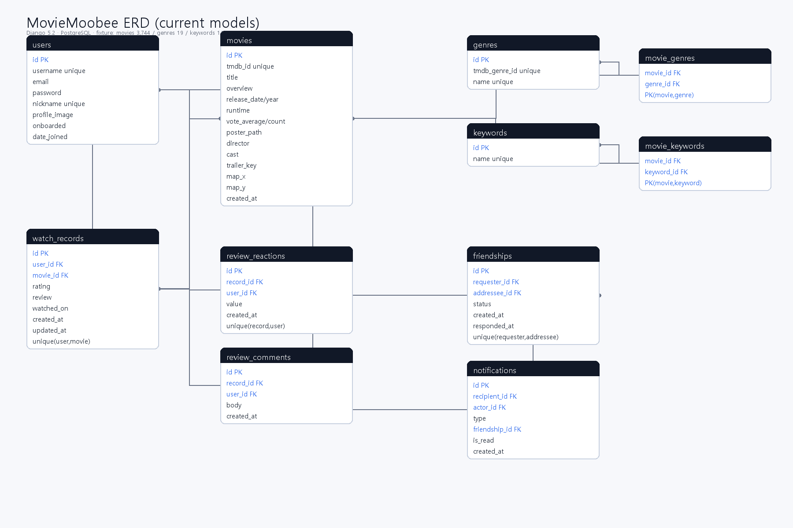

<div align="center">


### 좋아하는 영화가 아니라, *좋아하게 될* 영화를 추천하는 취향 지도 커뮤니티


</div>

# 무비무비 (MovieMoobee)

무비무비는 사용자가 본 영화와 별점을 **별자리 같은 "취향 지도"** 위에 펼치고, 그 지도를 바탕으로 영화를 추천·탐색하고 친구와 취향을 비교하는 웹 서비스입니다.

핵심 가치는 단순합니다. **"좋아하는 영화와 비슷한 작품"만 보여주는 필터 버블을 깨는 것.** 익숙한 취향을 강화하는 *가까운 취향* 추천과, 아직 가보지 않은 영역을 권하는 *새로운 취향* 추천을 함께 제공해, 사용자가 *앞으로 좋아하게 될* 영화를 발견하도록 돕습니다.

## 목차

- [팀원 정보 및 업무 분담](#팀원-정보-및-업무-분담)
- [목표 서비스 및 실제 구현 정도](#목표-서비스-및-실제-구현-정도)
- [핵심 흐름](#핵심-흐름)
- [주요 기능](#주요-기능)
- [생성형 AI 활용](#생성형-ai-활용)
- [추천 알고리즘](#추천-알고리즘)
- [기술 스택](#기술-스택)
- [프로젝트 구조](#프로젝트-구조)
- [주요 화면 라우팅](#주요-화면-라우팅)
- [ERD](#erd)
- [API 요약](#api-요약)
- [서비스 URL](#서비스-url)
- [실행 방법](#실행-방법)
- [검증 명령어](#검증-명령어)
- [Git / 협업 방식](#git--협업-방식)
- [향후 개선 방향](#향후-개선-방향)
- [한 줄 요약](#한-줄-요약)
- [회고 — 배운 점과 어려웠던 점](#회고--배운-점과-어려웠던-점)
- [느낀 점](#느낀-점)
- [실행 화면 캡처](#실행-화면-캡처)

## 팀원 정보 및 업무 분담

| 담당 | 영역 | 주요 구현 |
| --- | --- | --- |
| 김호준 | 지도 · 추천 · 데이터 | TMDB 데이터 수집·정제, 전역 영화 좌표 생성, 취향 지도(SVG) 렌더러, 가까운/새로운 취향 추천, KDE 탐색, GMS 추천·같이 볼 영화 챗봇 |
| 제하얀 | 인증 · 콘텐츠 · 소셜 | 회원가입/로그인/온보딩, 영화 검색·상세·OTT·예고편, 시청기록·별점·리뷰, 친구·알림(SSE) |
| 공통 | 구조 · 문서 | ERD, 라우팅, 공통 API/인증 구조, 협업 규칙, 제출 문서 |

## 목표 서비스 및 실제 구현 정도

| 목표 기능 | 구현 정도 | 구현 내용 |
| --- | --- | --- |
| 회원가입 / 로그인 / 인증 | 완료 | DRF 토큰 인증(dj-rest-auth + allauth), 이메일 로그인, 프로필 수정, 계정 삭제 |
| 온보딩 | 완료 | 인기작/검색으로 영화 5편 이상 등록해야 진입 |
| 취향 지도 | 완료 | 본 영화를 별(평점=크기·밝기·색)로 표시, 장르 대륙, 확대/팬·미니맵, 본 영화 클릭시 마커 |
| 영화 추천 | 완료 | 가까운 취향 · 새로운 취향 · 오늘의 추천 · 지도 탐색(공전 애니메이션) |
| 영화 검색 / 상세 | 완료 | 검색·등록, 상세, OTT 제공처, 예고편, 리뷰/댓글 |
| 시청 기록 / 리뷰 | 완료 | 별점(1단위)·감상평 등록/수정/삭제, 리뷰 반응(좋아요/싫어요)·댓글 |
| 커뮤니티(소셜) | 완료 | 친구 요청/수락/거절/삭제, 친구 취향 비교 지도, 같이 볼 영화 챗봇, 알림 |
| 알림 | 완료 | 알림 목록·안읽음 배지·SSE 실시간 갱신 |
| 생성형 AI | 완료 | GMS `gpt-5-nano` 기반 추천/같이 볼 영화 챗봇(후보 grounding), 일일 사용량 제한 |
| Carbon UI | 완료 | Tailwind 기반 다크 테마 디자인 시스템 |
| 배포 | 완료 | 배포 완료 |

## 핵심 흐름

```text
회원가입/로그인
  → 온보딩(영화 5편 이상 등록)
  → 취향 지도 생성 (본 영화 = 별, 장르 = 대륙)
  → 가까운 취향 / 새로운 취향 추천 · 지도 탐색
  → 영화 검색 / 상세 / 예고편 / 리뷰
  → 친구 추가 → 취향 비교 지도 → 같이 볼 영화 AI
  → 마이페이지에서 시청 기록·프로필 관리
```

## 주요 기능

### 1. 취향 지도

- 본 영화가 좌표 위 **빛나는 별**로 표시됩니다. 별점이 높을수록 크고 밝게 빛납니다.
- 영화 좌표는 **모든 사용자에게 동일·고정**(전역 좌표)이며, 장르가 "대륙"처럼 배치됩니다.
- 마우스 휠 확대/드래그 팬, 우하단 미니맵, 제목 검색 시 해당 별 반짝, 빈 곳 클릭으로 선택 해제.

### 2. 영화 추천

- **가까운 취향**: 내가 좋아한 영화 *각각*과 가까운 미시청 영화(취향 강화).
- **새로운 취향**: 내 시청 밀도가 낮은 영역의 영화(필터 버블 밖).
- **오늘의 추천 · 지도 탐색**: 지도 위에서 두 추천을 함께 확인. 가까운 취향 핀은 가까운 별 주위를 공전하다 호버하면 제자리로 모입니다.

### 3. 영화 검색 / 상세

- 제목 검색·등록, 전체 탐색, 영화 상세(개요·포스터·평점·연도).
- TMDB watch providers 기반 **OTT 제공처**(서버 캐싱), **예고편** 재생.

### 4. 시청 기록 / 리뷰

- 본 영화에 **별점(1 단위)** 필수 + 감상평(선택). 별점은 추천·지도에 반영됩니다.
- 리뷰 반응·댓글.

### 5. 커뮤니티

- 친구 검색·요청·수락/거절·삭제(상호 수락 기반).
- **친구 취향 비교 지도**: 두 사람의 별을 한 지도에 겹쳐 보고, 내/친구/공통 시청작을 강조 토글.
- **같이 볼 영화 AI**: 두 취향이 만나는 후보를 AI가 추천(지도에 표시 가능).
- 알림 목록·안읽음 배지·SSE 실시간 갱신.

### 6. 마이페이지 / 프로필

- 닉네임·프로필 이미지·온보딩 상태, 내 시청 기록 관리.

### 7. UI/UX

- Vue 3 SPA, **Tailwind 기반 Carbon 다크 테마** 디자인 시스템.
- 취향 지도는 컴포넌트 라이브러리 없이 **SVG로 직접** 렌더링.

## 생성형 AI 활용

같이 볼 영화 / 추천 챗봇에 **SSAFY GMS의 `gpt-5-nano`**(OpenAI 호환)를 사용합니다. LLM이 카탈로그 밖 영화를 지어내는 **환각을 막기 위해**, 서버가 좌표 기반으로 추천 후보를 추려 프롬프트에 넣고 *"이 목록 안에서만 골라라"* 로 grounding 합니다.

### AI 적용 흐름

```text
사용자 질문(자연어)
  → 서버가 취향 집합 기반으로 추천 후보 Top N 선정 (같이 볼 영화 = 두 사람 취향에 모두 가까운 영화)
  → 후보 목록 + 취향 장르를 시스템 프롬프트로 구성
  → GMS gpt-5-nano 호출, 응답을 SSE로 스트리밍
  → 프론트가 토큰 단위로 출력, 추천작은 '지도에 표시' 칩으로 연결
  → 계정당 하루 사용량 제한(토큰 낭비 방지)
```

### 후보 grounding 프롬프트 (같이 볼 영화)

핵심은 *"후보 목록 안에서만 추천"*, *"한 번에 한 편 + 이유"*, *"두 취향이 만나는 지점 짚기"* 입니다.

<details>
<summary>실제 시스템 프롬프트 구성 보기</summary>

```python
sys = (
    f"너는 두 친구가 '같이 볼 영화'를 고르도록 돕는 무비무비 AI야. 한국어 반말로 친근하게 답해.\n"
    f"- 내 취향 장르: {my_main}\n- 친구({friend.nickname})의 취향 장르: {fr_main}\n"
    f"{DOMAIN_GUARD}\n"
    f"아래 '후보' 목록 안에서만 골라 추천해(목록에 없는 영화는 절대 언급하지 마).\n"
    f"한 번에 한 편만 골라 제목과 2~3문장 이유를 써. 두 사람 취향이 만나는 지점을 짚어줘.\n"
    f"'더 가볍게' 같은 후속 요청엔 후보 안에서 다시 골라줘.\n\n[후보]\n{_fmt(cands)}"
)
```

`cands`(후보)는 두 사용자가 모두 안 본 영화 중 **두 취향 집합 모두에 가까운**(겹침 영역) 순으로 서버가 좌표 거리로 계산합니다 — 무게중심(점 1개)이 아니라 *집합 최근접* 기반입니다.

</details>

## 추천 알고리즘

무비무비의 추천·지도·친구 비교는 **사용자의 "시청 영화 집합"과 그 밀도**를 기준으로 동작합니다. (사용자를 한 점으로 요약하는 "센트로이드"는 의도적으로 폐기 — [회고](#회고--배운-점과-어려웠던-점) 참고)

- **전역 영화 좌표**: 장르·키워드 특징으로 2D 취향 좌표를 *오프라인에서* 생성해 저장합니다. 모든 사용자에게 동일·고정이며 재학습하지 않습니다.
- **가까운 취향**: 내가 좋아한 영화 *각각*의 고차원 최근접 미시청작을 **라운드로빈**으로 모아, 한 장르로 쏠리지 않게 합니다.
- **새로운 취향**: KDE로 추정한 저밀도(덜 본) 영역에서 장르 대륙별로 분산해 추천합니다.
- **친구 / 같이 볼 영화**: 두 사람이 모두 안 본 영화 중 *두 취향 집합 모두에 가까운* 영화를 후보로 제공합니다.


## 기술 스택

| 영역 | 기술 |
| --- | --- |
| Frontend | Vue 3 (Composition API), Vite, Vue Router, Axios, Tailwind CSS |
| Backend | Python 3.11, Django 5, Django REST Framework |
| Database | PostgreSQL (Docker Compose) |
| Auth | dj-rest-auth, django-allauth, DRF Token Authentication |
| Data / API | TMDB API, requests, python-dotenv |
| Recommendation | numpy, scipy(KDE) / scikit-learn(좌표 생성, 오프라인) |
| AI | SSAFY GMS `gpt-5-nano` (OpenAI 호환), SSE 스트리밍 |

> 상태 관리는 별도 스토어 없이 Vue 컴포저블(`use*`)로 구성했고, 인증은 JWT가 아닌 **DRF 토큰** 방식입니다.

## 프로젝트 구조

```text
13-pjt/
├─ backend/
│  ├─ config/          # Django 설정, 루트 URL, WSGI
│  ├─ accounts/        # 커스텀 User, 인증, 프로필, 온보딩
│  ├─ movies/          # 영화·장르·키워드, 시청기록, 리뷰 반응·댓글, OTT/예고편
│  ├─ social/          # 친구, 알림, 취향 비교, 같이 볼 영화 챗봇, 사용량
│  ├─ taste/           # 취향 지도·추천·탐색·챗봇
│  │  ├─ services/     # taste_map·recommend·areas(KDE)·chat·gms
│  │  └─ management/commands/   # import_movies·build_coords 등 오프라인 파이프라인
│  ├─ requirements.txt / requirements-ml.txt
│  └─ README.md        # 백엔드 상세
├─ frontend/
│  ├─ src/
│  │  ├─ api/          # Axios 클라이언트 + SSE(chat)
│  │  ├─ components/   # TasteMapCanvas(SVG)·ChatPanel(SSE) 등
│  │  ├─ composables/  # useCurrentUser·useMovieSearch·useTasteMap
│  │  ├─ router/ · layouts/ · views/ · assets/styles/
│  └─ README.md        # 프론트엔드 상세
├─ docs/               # 명세·ERD·와이어프레임·개발일지·기술노트
├─ docker-compose.yml  # 로컬 PostgreSQL
├─ .env.example
└─ README.md
```

하위 상세 문서: [`backend/README.md`](backend/README.md) · [`frontend/README.md`](frontend/README.md)

## 주요 화면 라우팅

| 경로 | 화면 |
| --- | --- |
| `/login`, `/signup` | 로그인 / 회원가입 |
| `/onboarding` | 온보딩(영화 5편 등록) |
| `/` | 홈(취향 지도 프리뷰 · 최근 영화) |
| `/map` | 취향 지도 · 시청 목록 · 검색·등록 · 지도 탐색 |
| `/movies`, `/movies/:id` | 영화 검색 / 상세 |
| `/recommend` | 추천(가까운 취향 · 새로운 취향 · 오늘의 추천) |
| `/records` | 내 시청 기록 |
| `/friends`, `/friends/:id` | 친구 목록 / 친구 취향 비교 |
| `/me`, `/me/edit` | 마이페이지 / 프로필 수정 |

## ERD



핵심 모델: `accounts.User`(닉네임·프로필·온보딩) · `movies.Movie`(TMDB·장르/키워드·좌표) · `movies.WatchRecord`(별점·감상평) · `movies.ReviewReaction`/`ReviewComment` · `social.Friendship` · `social.Notification` · `social.CowatchUsage`(챗봇 일일 사용량).

## API 요약

기본 prefix는 `/api/` 입니다. 인증은 `Authorization: Token <key>`.

| 영역 | 대표 엔드포인트 |
| --- | --- |
| 인증 | `/api/auth/`(로그인·로그아웃·유저·비번), `/api/auth/registration/`(회원가입) |
| 계정 | `/api/accounts/` (온보딩·프로필) |
| 영화 | `/api/movies/`(목록·검색), `/api/movies/:id/`(상세·OTT·예고편) |
| 시청기록 | `/api/watch-records/` (CRUD) |
| 소셜 | `/api/social/friends/…`, `/api/social/friends/:id/compare/`, `/api/social/friends/:id/cowatch/`(SSE), `/api/social/cowatch/usage/`, `/api/social/notifications/…`(목록·unread·SSE stream) |
| 취향 | `/api/taste/me/map`, `/api/taste/recommendations`, `/api/taste/explore` |

## 서비스 URL
- `https://moviemoobee.vercel.app/`

## 실행 방법

### 1. 환경 변수

```bash
cp .env.example .env
```

`.env`에 DB·`DJANGO_SECRET_KEY`·`TMDB_API_KEY`·`GMS_KEY`를 채웁니다. `.env`는 커밋하지 않습니다(`.gitignore`).

### 2. DB (PostgreSQL)

```bash
docker compose up -d
```

### 3. 백엔드

```bash
cd backend
python -m venv .venv
.venv\Scripts\Activate.ps1          # bash: source .venv/Scripts/activate
pip install -r requirements.txt
python manage.py migrate
python manage.py loaddata movies     # 영화 데이터(좌표 포함) 적재
python manage.py loaddata demo_users demo_community demo_social   # 유저데이터 적재
python manage.py runserver           # http://localhost:8000
```

좌표를 직접 재생성하려면(선택):

```bash
pip install -r requirements-ml.txt
python manage.py import_movies --count 2000
python manage.py build_coords
```

### 4. 프론트엔드

```bash
cd frontend
npm install
npm run dev                          # http://localhost:5173
```

## 검증 명령어

```bash
# 백엔드
cd backend && python manage.py check

# 프론트엔드
cd frontend && npx eslint src && npm run build
```

## Git / 협업 방식

GitHub Flow(GitLab) 기반입니다.

- `master` 직접 push 금지 → 기능별 브랜치 → MR → 동료 1명 승인 → Squash & Merge
- Conventional Commits (`type(featureID) subject`)
- `.gitlab/merge_request_templates/Default.md` MR 템플릿 사용
- `.env`·API Key 등 시크릿 커밋 금지

상세: `docs/05_collaboration_rules.docx`, `docs/notion/collaboration_rules.md`.

## 향후 개선 방향

- 좌표·추천 선계산 결과를 활용한 **클라우드 배포**(Vercel + Render + Supabase)
- 챗봇 사용량/캐싱 고도화, 추천에 커뮤니티 반응 반영
- 시청 기록 시계열 기반 추천 가중치
- 업로드 이미지 외부 스토리지 전환

## 배포
- FE : vercel
- BE : render
- DB(PostgreSQL) : supabase

배포 URL : https://moviemoobee.vercel.app

> 하위 문서: 백엔드 상세는 [`backend/README.md`](backend/README.md), 프론트엔드 상세는 [`frontend/README.md`](frontend/README.md)를 참고하세요.

## 13. 회고 — 배운 점과 어려웠던 점

구현 과정에서 학습한 내용·시행착오·개선 결정을 정리했습니다. 작업 단위의 상세 기록은 `docs/08_journal/`(A-01 ~ A-15)에 있습니다.

### 가장 크게 헤맸고, 그래서 가장 많이 배운 것 — "사용자 좌표"의 폐기

처음에는 사용자의 평점 가중 평균점을 지도에 한 점("사용자 좌표")으로 찍고, 그 점에서 가까운 영화를 추천하는 직관적인 방식으로 시작했습니다(A-05). 그런데 한 사람이 액션과 멜로를 모두 좋아하는 **멀티모달 취향**이면, 두 봉우리의 평균점이 **아무것도 없는 골짜기**에 떨어져 엉뚱한 장르를 추천하는 문제가 드러났습니다(A-08). 또 좌표의 원점 자체가 임의적이라 "중심점"이 취향을 의미 있게 담지 못했습니다(A-06).

결국 **"사용자 좌표/센트로이드" 개념을 완전히 폐기**하고, 추천·지도·친구 비교 전부를 **사용자의 "시청 영화 집합"과 그 밀도(KDE)** 기준으로 다시 설계했습니다(A-15). "당연해 보이는 평균"이 왜 틀렸는지를 데이터로 확인한 것이 이번 프로젝트에서 가장 값진 학습이었습니다.

### 그 외 기술적 도전과 배운 점

- **전역 좌표 불변식**: 영화 좌표는 모든 사용자에게 동일하고 고정되어야 합니다. 새 영화가 들어와도 저장된 모델의 `transform()`만 쓰고 **절대 재학습(re-fit)하지 않습니다** — 재학습하면 모두의 좌표가 흔들려 친구 취향 비교가 깨지기 때문입니다(A-14).
- **추천 쏠림 해결**: 단일 점/2D kNN은 가장 밀집한 한 장르로만 추천이 쏠렸습니다. 좋아한 영화 *각각*의 고차원 임베딩 최근접을 **라운드로빈**으로 돌려 모든 취향 봉우리를 골고루 추천하도록 바꿨습니다(A-15).
- **미탐색(새로운 취향) 다양성**: KDE 저밀도 영역을 장르 "대륙"별로 분산해, 필터 버블 밖이면서도 한쪽으로 치우치지 않게 했습니다(A-13).
- **SSE 스트리밍 + 토큰 인증**: 챗봇·알림 실시간 갱신을 `EventSource` 대신 `fetch` + `ReadableStream`으로 구현해 `Authorization` 헤더를 실어 보냈고, 멀티바이트(한글) 청크 경계를 안전하게 합쳤습니다.
- **LLM 환각 억제**: 추천 챗봇이 후보 목록 **밖의 영화를 지어내지 않도록** 서버에서 grounding 후보를 프롬프트에 고정했습니다.
- **지도 시각화**: 컴포넌트 라이브러리 없이 SVG로 직접 그렸고, 좌표가 겹치는 별·핀은 황금각 나선으로 분산했습니다.

### 어려웠던 점

- 추천 "품질"은 테스트로 잡기 어려워, 실제 데이터로 결과를 눈으로 확인하며 여러 번 재설계해야 했습니다.
- 전역 좌표의 안정성(재현성)과 ML 의존성(numpy/scipy/scikit-learn)의 빌드·런타임 분리를 신경 써야 했습니다.

### 느낀 점

<!-- 제하얀 님의 소감을 채워주세요. -->

- **김호준 (지도·추천·데이터)**: 주제 선정부터 기획, 구현까지 전 과정을 처음으로 끝까지 경험해봤는데, 의미가 깊었던 만큼 정말 힘든 시간이기도 했습니다. 특히 "기획은 정말 잘했다"고 자신했는데, 막상 구현에 들어가니 생각보다 허점이 많았습니다. 대표적으로 사용자의 취향을 지도 위 *한 점(사용자 좌표)* 으로 요약해 추천하려던 초기 설계는, 액션과 멜로를 동시에 좋아하는 사람의 평균점이 아무것도 없는 골짜기에 떨어지는 걸 눈으로 보고 나서야 근본부터 틀렸다는 걸 깨달았고, 결국 *시청 영화 집합* 기반으로 추천·지도·친구 비교를 전부 다시 설계해야 했습니다(`docs/08_journal` A-05~A-15). 추천 알고리즘을 짜는 과정이 특히 그랬습니다. 머릿속에선 그럴듯했던 로직이 실제 데이터에 부딪히면 한 장르로 쏠리거나 엉뚱한 영역을 추천하는 등 허점이 계속 드러나, 좋아한 영화별 최근접을 라운드로빈하는 방식에 이르기까지 몇 번이고 갈아엎어야 했습니다. 그러면서 프로그래밍은 정말 *고려해야 할 것이 많은* 일이라는 걸 절감했습니다 — 좌표는 모든 사용자에게 고정돼야 한다는 불변식, 데이터 수집·정제, 빌드와 런타임 의존성 분리, 협업 규칙까지, 눈에 보이는 기능 뒤에 챙겨야 할 것이 훨씬 많았습니다. 힘들었지만 "당연해 보이는 설계가 왜 틀리는지"를 데이터로 직접 확인하며 배운 것이 가장 값진 경험이었습니다.
- 제하얀: "되겠지" 싶은 직관적인 코드일수록(평균 좌표, 라우터 가드, 한 번에 `annotate`, 고정폭 레이아웃) 실제 데이터와 화면에서 깨지는 걸 반복해서 겪었습니다. "돌아가는 것"과 "맞게 도는 것"은 다르다는 걸 몸으로 배웠고, 백엔드 한 줄이 SQL과 화면으로 어떻게 번역되는지 끝까지 따라가 본 경험이 가장 크게 남습니다. 또 작은 결정 하나도 페어와 맞춰가며 눈으로 확인하는 습관이, 돌아가는 듯 보였던 길보다 결국 더 빠른 길이었습니다. 또한 취향 지도, 영화 카드, 추천 영역, 별 아이콘 같은 UI를 계속 수정하면서 단순히 예쁜 화면을 만드는 것보다 사용자가 서비스를 직관적으로 이해하게 만드는 게 중요하다는 걸 느꼈습니다. 같은 기능이라도 배치, 색상, 버튼 표현에 따라 서비스의 완성도가 크게 달라짐을 느끼며, UI에 대한 시각도 변했습니다. 그리고 브랜치, 머지, 충돌, README 수정 같은 작은 작업에서도 팀원과 변경사항을 맞추지 않으면 쉽게 꼬일 수 있었습니다. 이번 프로젝트를 통해 기능을 나눠서 개발하는 것뿐만 아니라, 현재 어떤 작업을 하고 있는지 공유하고 커밋 단위를 잘 나누는 것이 협업의 중요한 부분이라는 걸 느낄 수 있었습니다. 
